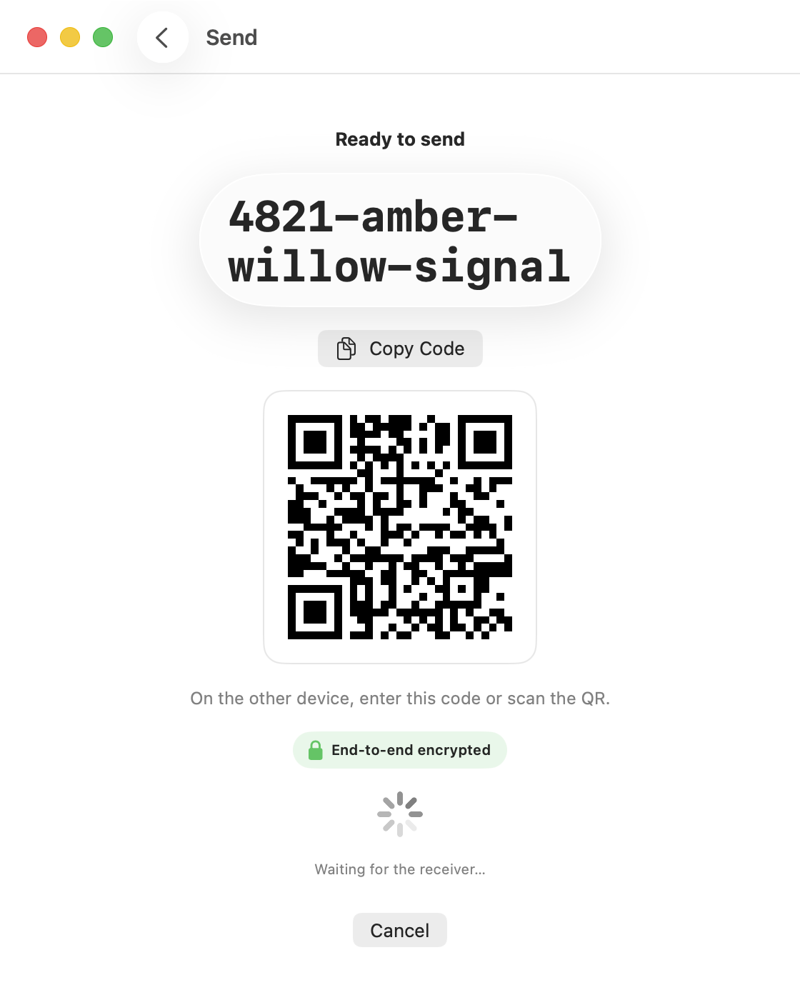
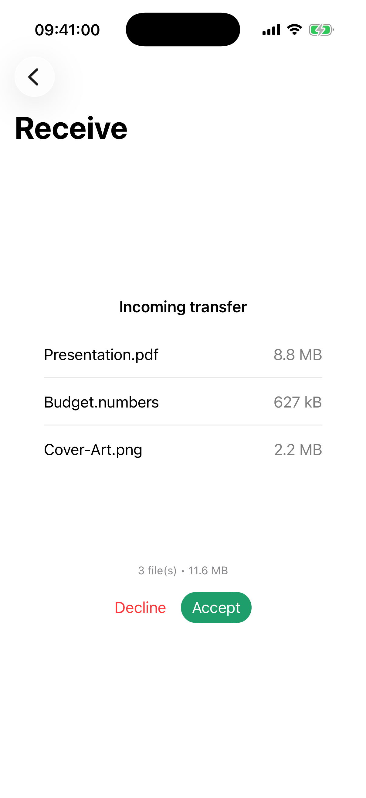
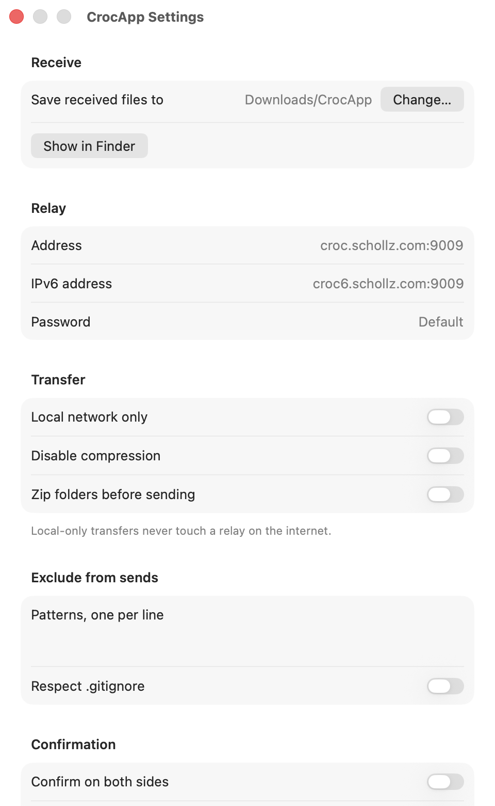
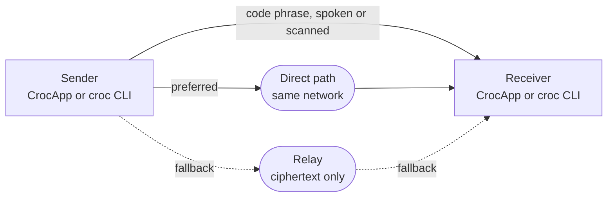

<p align="center">
  <a href="https://crocapp.dev"></a>
</p>

<h1 align="center">CrocApp</h1>

<p align="center">
  <strong>Send a file to any device, anywhere, with a code phrase.</strong><br>
  A free, open-source native SwiftUI app for iPhone, iPad, and Mac.
</p>

<p align="center">
  <a href="https://github.com/bakirgdev/CrocApp/actions/workflows/ci.yml"></a>
  
  <a href="LICENSE"></a>
  <a href="https://github.com/sponsors/bakirgdev"></a>
  <a href="https://crocapp.dev"></a>
</p>

## What it is

CrocApp sends files, folders, and text between two devices anywhere in the world, encrypted end to end, using a short spoken code phrase like `8412-mirage-cobalt-fresco`. No account. No upload to someone else's cloud. No requirement that both devices share a network.

It is a graphical front end for [croc](https://github.com/schollz/croc), the command-line file-transfer tool by Zack Scholl. CrocApp embeds croc's Go library rather than shelling out to the binary, so **a code phrase generated by the croc CLI works in the app, and vice versa**.

> [!NOTE]
> CrocApp is unofficial and unaffiliated. Nothing here implies endorsement by croc's author.

## Status

> [!IMPORTANT]
> **Not released yet.** No download exists on any channel. The source is public and buildable today — see [Build from source](#build-from-source).

| Channel | State |
|---|---|
| iOS / iPadOS App Store | Planned |
| Mac App Store | Planned |
| macOS direct download (notarized DMG) | Planned |
| Homebrew cask | Blocked on notarization ([ADR 0007](docs/decisions/0007-distribution-channels.md)) |
| TestFlight beta | Planned |

Every V1 feature is implemented. What stands between the app and a release is tracked in [`docs/known-issues.md`](docs/known-issues.md) under "Blocking release".

## Screenshots

<!-- TODO: capture these six PNGs into assets/screenshots/ before release.
     Light and dark are separate files; GitHub swaps them by viewer theme. -->

<picture>
  <source media="(prefers-color-scheme: dark)" srcset="assets/screenshots/mac-send-dark.png">
  <source media="(prefers-color-scheme: light)" srcset="assets/screenshots/mac-send-light.png">
  
</picture>

<picture>
  <source media="(prefers-color-scheme: dark)" srcset="assets/screenshots/ios-receive-dark.png">
  <source media="(prefers-color-scheme: light)" srcset="assets/screenshots/ios-receive-light.png">
  
</picture>

<picture>
  <source media="(prefers-color-scheme: dark)" srcset="assets/screenshots/mac-settings-dark.png">
  <source media="(prefers-color-scheme: light)" srcset="assets/screenshots/mac-settings-light.png">
  
</picture>

## How it works



1. The sender picks files, a folder, or a snippet of text.
2. CrocApp generates a code phrase. Speak it, message it, or show it as a QR code.
3. The receiver enters the phrase, sees the file list, and accepts.

Both sides run PAKE over the code phrase to derive a session key, so the phrase never crosses the network in the clear and the relay never learns the key. When both devices are on the same network, CrocApp connects directly and skips the relay entirely.

## Security

Transfers are end-to-end encrypted, the code phrase authenticates both sides, and the relay only ever sees ciphertext. That is the entire claim.

> [!WARNING]
> There has been **no formal third-party security audit** of croc, and CrocApp does not claim one. Do not describe CrocApp as audited, certified, or zero-knowledge-verified.

- No telemetry, no analytics, no ads, no accounts.
- Transfer history is local to the device.
- You can point CrocApp at your own croc relay instead of the default public one.
- Vulnerabilities: report privately via [GitHub Security Advisories](https://github.com/bakirgdev/CrocApp/security/advisories/new), never a public issue.

## Features

Everything below is implemented and working in the app. Feature numbers (`F1`…) are stable identifiers used across the codebase and issues — see [`docs/knowledge/features.md`](docs/knowledge/features.md) for the full roadmap, including what is deferred.

<details>
<summary><strong>Core transfer</strong></summary>

| | Feature | croc equivalent |
|---|---|---|
| F1 | Send files, multiple at once, drag-drop or picker | positional args |
| F2 | Send folders | positional args |
| F3 | Send text and clipboard contents | `--text` |
| F4 | Receive by code phrase | positional args |
| F5 | Custom code phrase | `--code` |
| F6 | Show QR on send, scan QR on receive | `--qrcode` |
| F7 | Choose output folder; Files-visible by default on iOS | `--out` |
| F8 | Overwrite and resume handling via confirm sheets | `--overwrite` |
| F9 | Preview the incoming file list, then accept or decline | interactive prompt |
| F10 | Live progress, speed, cancel; Live Activity on iOS | — |
| F11 | LAN and relay raced automatically | croc default |
| F12 | Local transfer history | — |

</details>

<details>
<summary><strong>Power options</strong></summary>

| | Feature | croc equivalent |
|---|---|---|
| F13 | Custom relay, password, IPv6 | `--relay --relay6 --pass` |
| F14 | Force local-only transfers | `--local` |
| F15 | Disable compression | `--no-compress` |
| F16 | Zip a folder before sending | `--zip` |
| F17 | Exclude patterns, respect `.gitignore` | `--exclude --git` |
| F18 | Auto-accept incoming, off by default | `--yes` |
| F19 | Require confirmation on both sides | `--ask` |

</details>

<details>
<summary><strong>Native to the app</strong></summary>

| | Feature |
|---|---|
| F30 | Share extension — send from any app (iOS) |
| F36 | Trust UI: end-to-end badge, "how it works", active-relay indicator |

</details>

## Build from source

Requires **macOS 26**, **Xcode 26.6**, and **Go 1.26.5 or newer**. `gomobile` and `gobind` install themselves on first run.

```bash
git clone https://github.com/bakirgdev/CrocApp.git
cd CrocApp
scripts/build-xcframework.sh   # Go engine -> CrocKit/Croc.xcframework
open app/CrocApp.xcodeproj
```

> [!IMPORTANT]
> A fresh clone builds nothing until the xcframework exists. `CrocKit`'s binary target points at a gitignored artifact, so `scripts/build-xcframework.sh` is not optional ([ADR 0006](docs/decisions/0006-gomobile-binding.md)).

<details>
<summary><strong>Command line builds, linting, and verification</strong></summary>

```bash
# builds (from app/)
xcodebuild -scheme CrocApp -destination 'platform=macOS' build
xcodebuild -scheme CrocApp -destination 'platform=iOS Simulator,name=iPhone 17 Pro' build

# format and lint, same as CI
xcrun swift-format format --in-place --recursive --parallel app/CrocApp app/CrocShare CrocKit/Sources
xcrun swift-format lint --recursive --parallel --strict app/CrocApp app/CrocShare CrocKit/Sources
golangci-lint run ./...    # from crocmobile/
govulncheck ./...          # from crocmobile/
```

A green build is **not** evidence that a transfer works. Real behaviour is checked by harnesses that run live transfers against the croc CLI over the public relay:

```bash
scripts/verify-interop.sh     # 9 scenarios, engine <-> croc CLI, both directions
scripts/verify-app-mac.sh     # macOS app, 6 transfer directions
scripts/verify-app-sim.sh     # iOS simulator receive
scripts/verify-share-sim.sh   # share-extension handoff
```

Any change to `crocmobile/session.go`, `CrocKit/Sources/`, or `TransferController` needs the matching harness run.

</details>

## FAQ

<details>
<summary><strong>How is this different from AirDrop?</strong></summary>

AirDrop needs two Apple devices in physical proximity. CrocApp works between any two devices running croc or CrocApp, on any network, at any distance — including from a Mac to a Linux server across the world.

</details>

<details>
<summary><strong>Does it work with the croc CLI?</strong></summary>

Yes, in both directions. CrocApp embeds croc v10.5.0 as a library, so it speaks the same protocol. `croc send` on a laptop, receive in the app on a phone, and the reverse.

</details>

<details>
<summary><strong>Why iOS 26 and macOS 26 only?</strong></summary>

Greenfield app with no existing users. Supporting older releases means availability checks everywhere and giving up current SwiftUI APIs and the Liquid Glass design language. The floor is pinned at exactly `26.0`, never a minor ([ADR 0003](docs/decisions/0003-min-os-ios26-macos26.md)).

</details>

<details>
<summary><strong>Is it free? Will it ever have a paid tier?</strong></summary>

Free, MIT-licensed, and it stays that way. Monetization is limited to optional [sponsorship](https://github.com/sponsors/bakirgdev).

</details>

<details>
<summary><strong>Will there be a Windows, Linux, or Android version?</strong></summary>

No. CrocApp is Apple-platform only by design. Use the [croc CLI](https://github.com/schollz/croc) elsewhere — it interoperates with this app.

</details>

## Project layout

| Path | What lives there |
|---|---|
| `app/` | Xcode project: SwiftUI app (`CrocApp`) and share extension (`CrocShare`) |
| `CrocKit/` | Swift package wrapping the Go engine: `CrocEngine` actor, `AsyncStream<TransferEvent>` |
| `crocmobile/` | Go wrapper around croc, bound into `Croc.xcframework` via gomobile |
| `design/` | Design system: tokens, component specs, SF Symbols mapping |
| `docs/` | Knowledge base, architecture decision records, known issues |
| `scripts/` | Build and live-transfer verification harnesses |
| `web/landing/` | The [crocapp.dev](https://crocapp.dev) landing page |
| `assets/` | Icon source, banner, mascot |

## Docs

| | |
|---|---|
| [`docs/knowledge/`](docs/knowledge/README.md) | What croc is, how the bridge works, UI architecture, platform constraints |
| [`docs/decisions/`](docs/decisions/README.md) | Architecture decision records, numbered and dated |
| [`docs/known-issues.md`](docs/known-issues.md) | Triaged defects and accepted papercuts. **Check here before filing a bug** |
| [`design/`](design/README.md) | Canonical design system for the app, landing page, and docs site |

## Contributing

Pull requests are welcome: bugs, features, docs, design, landing page. Start with [`CONTRIBUTING.md`](CONTRIBUTING.md). It covers setup, commit conventions, the design rules, and how changes to the transfer path have to be verified.

| | |
|---|---|
| [`CONTRIBUTING.md`](CONTRIBUTING.md) | Setup, branches, commits, style, verification, PR flow |
| [`CODE_OF_CONDUCT.md`](CODE_OF_CONDUCT.md) | Contributor Covenant 3.0 |
| [`SECURITY.md`](SECURITY.md) | Scope and private reporting for vulnerabilities |

## Credits

- [croc](https://github.com/schollz/croc) by [Zack Scholl](https://github.com/schollz) — the transfer engine that makes this possible. MIT.
- CrocApp by [Bakir Gracic](https://github.com/bakirgdev). MIT.
